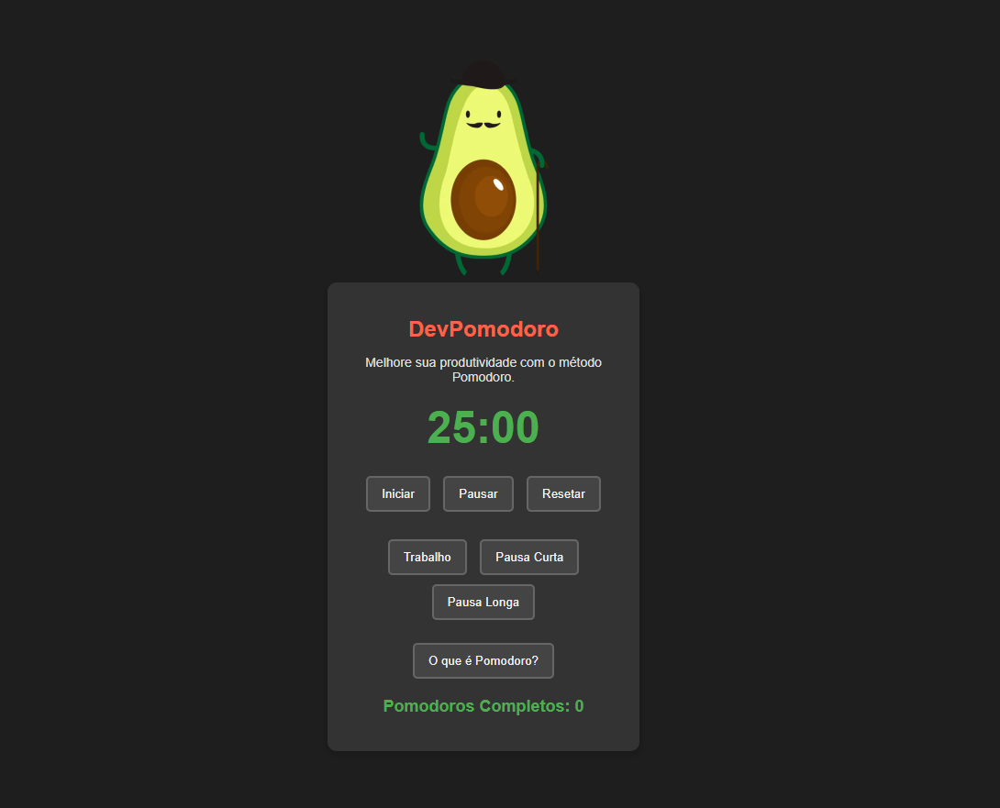

<h1>Projeto Temporizador Dev Pomodoro</h1>

Tive a ideia de fazer esse projeto a fim de aprender a funcionalidade setInterval e setTimeout do JavaScript

Como eu uso um temporizador nos meus estudos, pensei em realizar um projeto a fim de facilitar meus estudos e a realização de um dos melhores metodos de estudo, o Pomodoro.

<h3>Tecnologias Utilizadas:</h3>
<ul>
  <li>HTML</li>
  <li>CSS</li>
  <li>JavaScript</li>
</ul>

<h4>Desktop:

